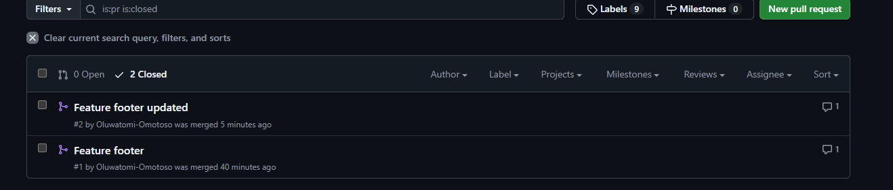

# Frontend Version Control Task — Oluwatomi

## Project Purpose

This repository demonstrates my understanding of Git and GitHub workflows, including branching, commits, pull requests, merging, reverting, and branch management. The project focuses on building basic frontend components: a header and footer.

---

## Branch Names & Purpose

| Branch Name              | Purpose                                                        |
| ------------------------ | -------------------------------------------------------------- |
| `main`                   | Holds the stable version of the project                        |
| `feature-header`         | Developed the header component                                 |
| `feature-footer-updated` | Developed the footer component (renamed from `feature-footer`) |

---

## Merged Pull Requests

- `feature-footer → feature header` ✅
- `feature-footer-updated → main` ✅

---

## Git Commands Used Most Frequently

- `git init` — Initialize a new repo
- `git branch` — List branches / manage branches
- `git checkout -b [branch]` — Create and switch to a new branch
- `git add .` — Stage changes
- `git commit -m "message"` — Commit changes
- `git push` — Push changes to remote
- `git pull` — Fetch and merge remote changes
- `git revert [commit]` — Undo accidental changes
- `git branch -m [old] [new]` — Rename branch
- `git fetch` — Update local repo with remote changes

---

## Lessons Learned

- Always double-check which branch you are on before committing.
- Pull requests are a safer way to merge changes than pushing directly to `main`.
- Reverting commits is essential for fixing mistakes without rewriting history.
- Renaming branches keeps your repo organized, especially in collaborative workflows.
- Proper commit messages and structured branches improve readability and maintainability.
